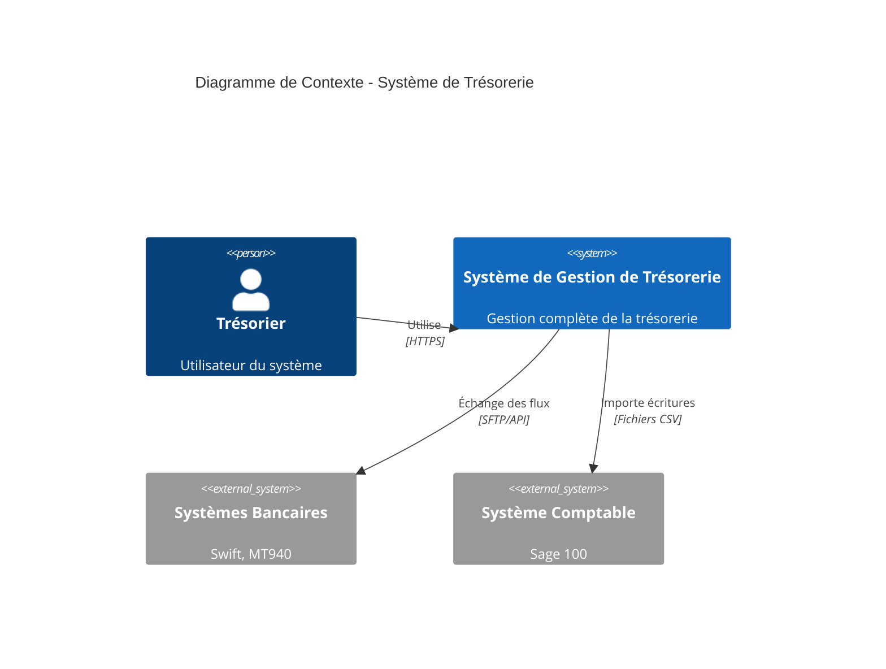
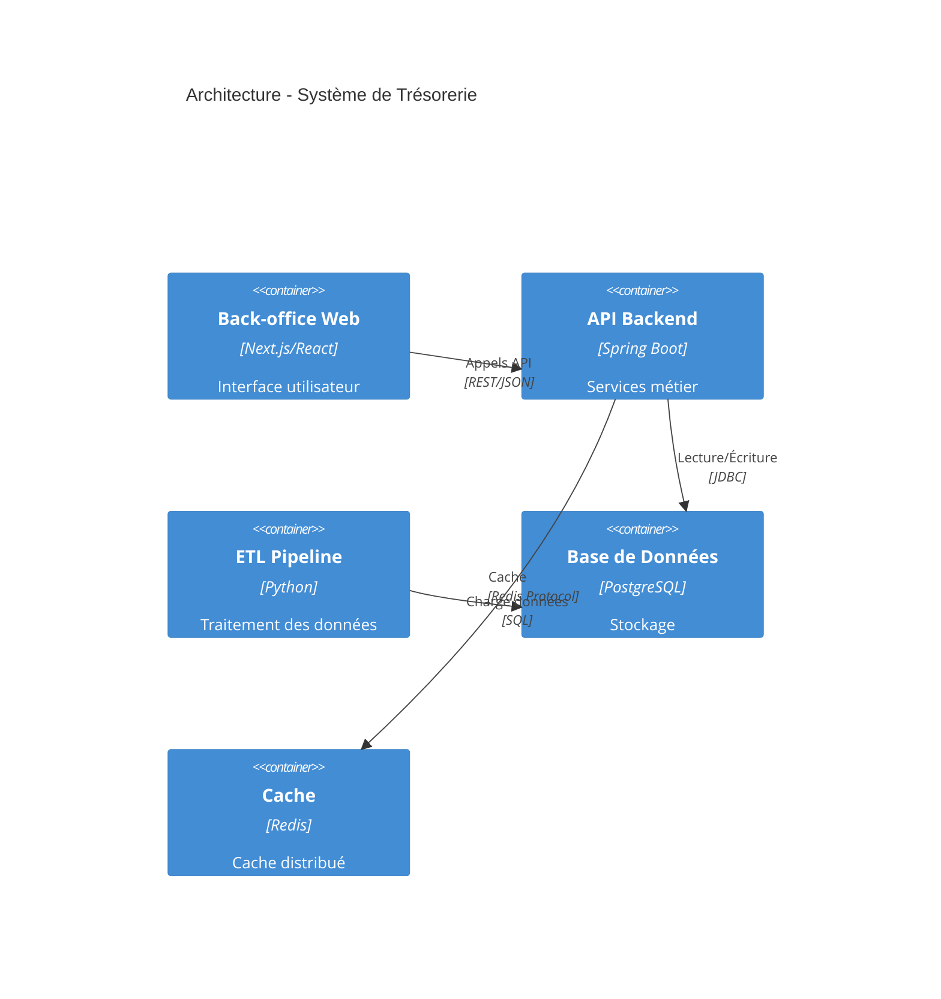
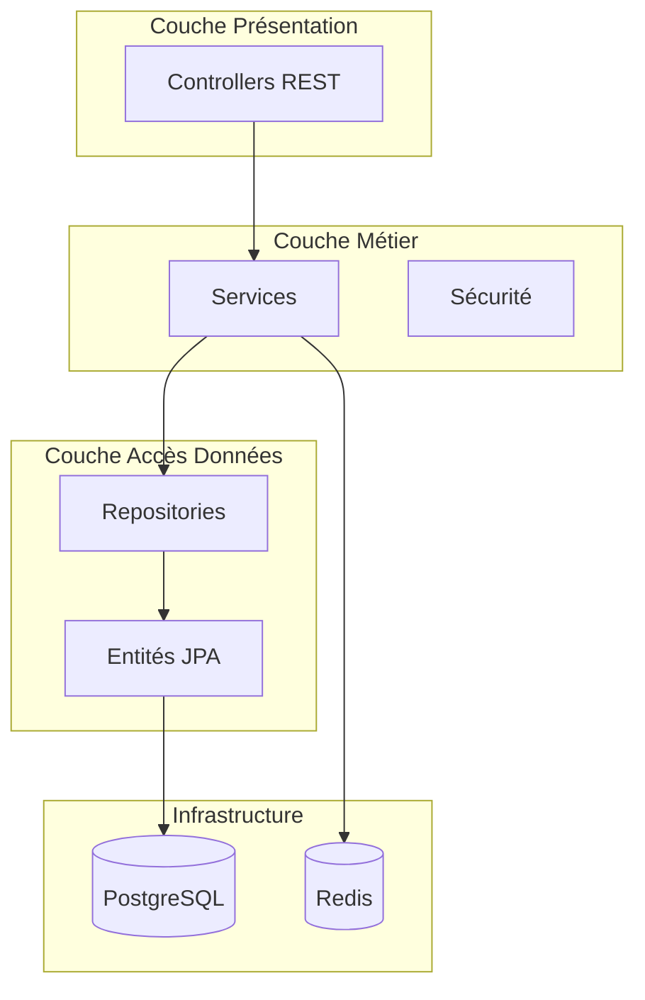
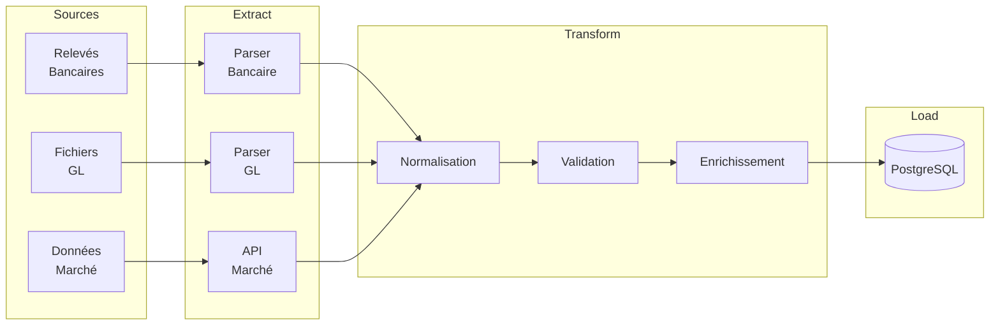
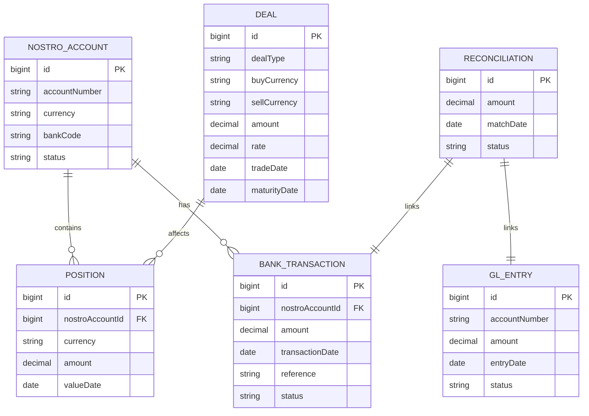
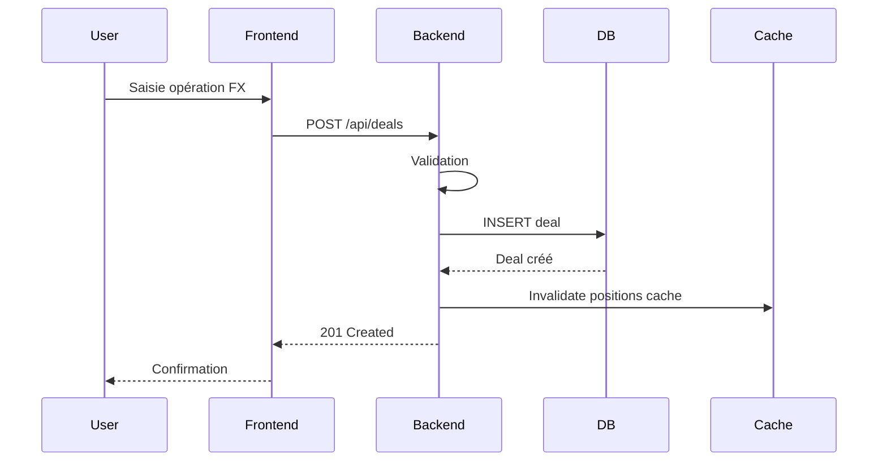
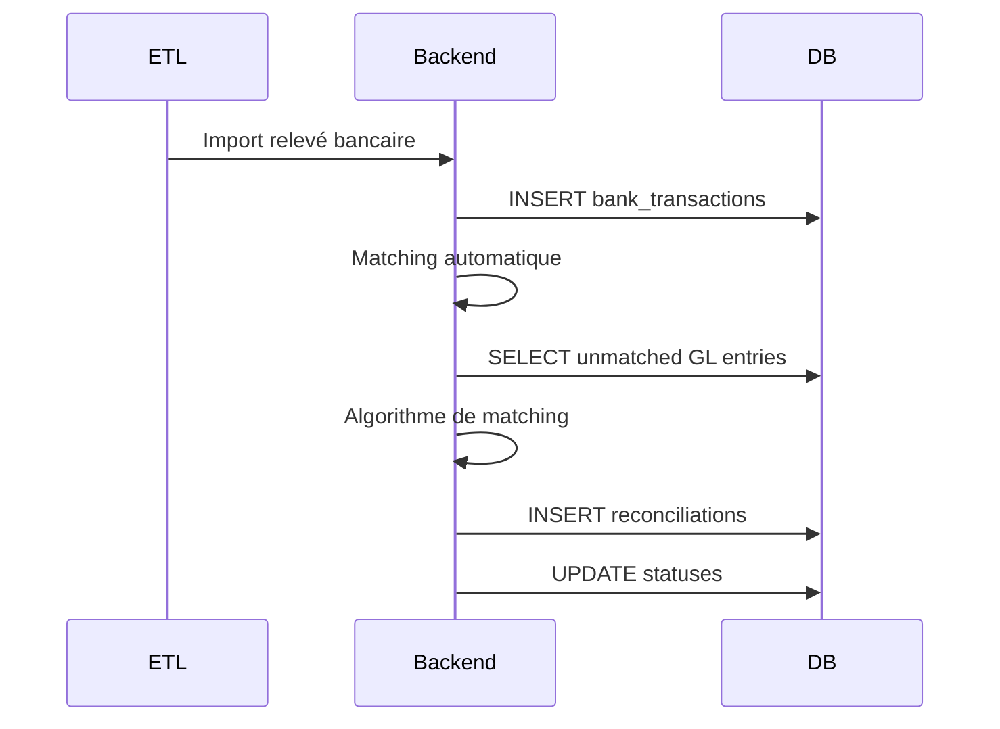
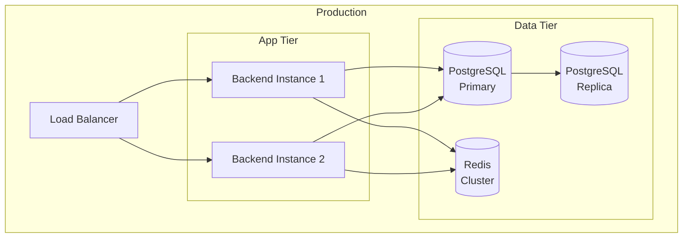

# Architecture - [Nom du Système]

## Introduction

Ce document décrit l'architecture du **[Nom du Système/Module]**, partie intégrante du Système de Gestion de Trésorerie (SGT).

### Objectifs

- Objectif 1
- Objectif 2
- Objectif 3

### Portée

Ce document couvre:
- Composant A
- Composant B
- Intégrations C

---

## Vue d'Ensemble

### Contexte

[Description du contexte métier et des besoins]

### Diagramme de Contexte (C4 Level 1)



---

## Architecture Globale

### Diagramme de Conteneurs (C4 Level 2)



### Composants Principaux

| Composant | Technologie | Responsabilité |
|-----------|-------------|----------------|
| **Frontend** | Next.js 14, React 18, TypeScript | Interface utilisateur responsive |
| **Backend** | Spring Boot 3.2, Java 17 | API REST, logique métier |
| **ETL** | Python 3.11, Pandas | Extraction et transformation de données |
| **Base de Données** | PostgreSQL 15 | Persistance des données |
| **Cache** | Redis 7 | Cache distribué, sessions |
| **Message Queue** | RabbitMQ | Traitement asynchrone |

---

## Architecture Backend

### Architecture en Couches



### Modules Backend

```
backend/
├── controller/         # Endpoints REST
│   ├── DealController
│   ├── PositionController
│   └── ReconciliationController
├── service/           # Logique métier
│   ├── DealService
│   └── PositionService
├── repository/        # Accès données
│   ├── DealRepository
│   └── PositionRepository
├── domain/           # Entités JPA
│   ├── Deal
│   ├── Position
│   └── NostroAccount
├── dto/              # Objets de transfert
│   ├── DealRequest
│   └── PositionResponse
├── config/           # Configuration
│   ├── SecurityConfig
│   └── DatabaseConfig
└── integration/      # Intégrations externes
    ├── gl/
    └── swift/
```

### Patterns Utilisés

1. **Repository Pattern**: Abstraction de l'accès aux données
2. **Service Layer Pattern**: Encapsulation de la logique métier
3. **DTO Pattern**: Séparation entités/API
4. **Dependency Injection**: Inversion de contrôle avec Spring
5. **Transaction Management**: Transactions JPA pour la cohérence

---

## Architecture ETL

### Pipeline de Données



### Extracteurs (Parsers)

- **GlFileParser**: Parse les exports Sage 100 (CSV)
- **BankStatementParser**: Parse les relevés MT940/CAMT.053
- **DealImporter**: Importe les opérations de marché

### Transformateurs

- **CurrencyNormalizer**: Normalisation des codes devises
- **AmountConverter**: Conversion entre formats numériques
- **DateStandardizer**: Standardisation des dates (ISO 8601)

### Chargeurs

- **DatabaseLoader**: Insertion bulk dans PostgreSQL
- **CacheUpdater**: Mise à jour du cache Redis

---

## Modèle de Données

### Diagramme Entités-Relations



### Entités Principales

1. **NostroAccount**: Comptes bancaires
2. **Position**: Positions de change
3. **Deal**: Transactions financières
4. **GlEntry**: Écritures comptables
5. **BankTransaction**: Mouvements bancaires
6. **Reconciliation**: Rapprochements

---

## Flux de Données

### Flux: Création d'une Opération de Change



### Flux: Rapprochement Bancaire



---

## Sécurité

### Authentification et Autorisation

- **JWT (JSON Web Token)** pour l'authentification
- **Spring Security** pour le contrôle d'accès
- **RBAC (Role-Based Access Control)** pour les permissions

### Rôles

| Rôle | Permissions |
|------|-------------|
| `TREASURY_USER` | Consultation, création opérations |
| `TREASURY_ADMIN` | Approbation, configuration |
| `TREASURY_VIEWER` | Consultation seule |

### Sécurité des Données

- **Encryption at rest**: AES-256 pour les données sensibles
- **Encryption in transit**: TLS 1.3 pour toutes les communications
- **Audit**: Enregistrement de toutes les opérations critiques

---

## Performance et Scalabilité

### Stratégies de Cache

- **Application Cache**: Redis pour les taux de change, positions
- **Database Cache**: Query cache PostgreSQL
- **HTTP Cache**: ETags pour les ressources statiques

### Optimisations

1. **Pagination**: Toutes les listes sont paginées
2. **Lazy Loading**: Chargement différé des relations JPA
3. **Connection Pooling**: HikariCP pour les connexions DB
4. **Index Database**: Index sur les colonnes fréquemment requêtées

### Limites

- **Max transactions/seconde**: 100
- **Max positions simultanées**: 10,000
- **Max deals/jour**: 5,000

---

## Déploiement

### Architecture de Déploiement



### Environnements

| Environnement | URL | Base de Données |
|---------------|-----|-----------------|
| **Développement** | localhost:8080 | Local PostgreSQL |
| **Staging** | staging.example.com | Staging DB |
| **Production** | api.example.com | Production DB (HA) |

---

## Monitoring et Logging

### Métriques

- **APM**: Application Performance Monitoring avec Spring Actuator
- **Logs**: Centralisés avec ELK Stack (Elasticsearch, Logstash, Kibana)
- **Alertes**: Prometheus + Grafana

### KPIs

- Temps de réponse API (p95 < 200ms)
- Taux d'erreur (< 0.1%)
- Disponibilité (> 99.9%)

---

## Intégrations

### Systèmes Externes

| Système | Protocole | Direction | Données |
|---------|-----------|-----------|---------|
| **Sage 100** | SFTP/CSV | Importation | Écritures GL |
| **Swift Network** | MT940 | Importation | Relevés bancaires |
| **Bloomberg** | API REST | Importation | Taux de marché |
| **BCEAO** | CAMT.053 | Importation | Mouvements compte central |

---

## Glossaire

Voir [glossary.md](../glossary.md) pour la terminologie complète.

---

## Références

- [Documentation API](./api.md)
- [Guide Développeur](./developer_guide.md)
- [Guide Déploiement](./deployment.md)

---

## Annexes

### Technologies et Frameworks

- **Backend**: Spring Boot 3.2, Spring Security, Spring Data JPA
- **Frontend**: Next.js 14, React 18, TypeScript, Tailwind CSS
- **ETL**: Python 3.11, Pandas, SQLAlchemy
- **Database**: PostgreSQL 15, Hibernate ORM
- **Cache**: Redis 7
- **Build**: Maven 3.9, npm/pnpm
- **Testing**: JUnit 5, Mockito, Jest, Playwright

### Standards et Conventions

- **Coding Style**: Google Java Style Guide
- **API Design**: RESTful principles, OpenAPI 3.0
- **Database**: Naming conventions snake_case
- **Versioning**: Semantic Versioning (SemVer)
