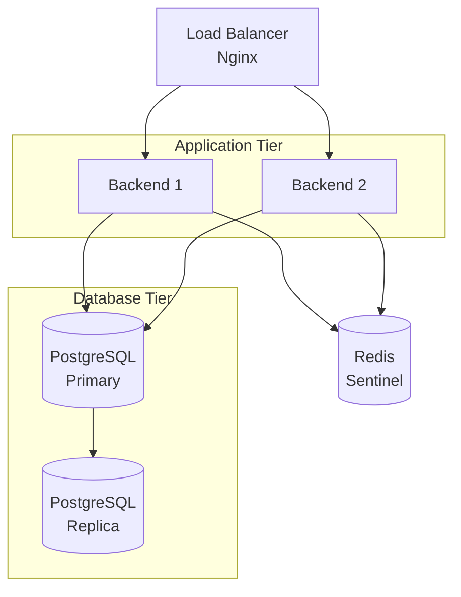

# Guide de Déploiement - Backend Trésorerie

## Introduction

Ce guide décrit la procédure de déploiement du backend du Système de Gestion de Trésorerie (SGT).

---

## Prérequis

### Matériel

- **CPU**: 4 cores minimum (8+ recommandé en production)
- **RAM**: 8 GB minimum (16+ GB recommandé)
- **Disque**: 50 GB SSD minimum
- **Réseau**: 1 Gbps

### Logiciels

| Composant | Version | Installation |
|-----------|---------|--------------|
| **Java JDK** | 17+ | `sudo apt install openjdk-17-jdk` |
| **Maven** | 3.8+ | `sudo apt install maven` |
| **PostgreSQL** | 15+ | `sudo apt install postgresql-15` |
| **Redis** | 7+ | `sudo apt install redis-server` |
| **Docker** (optionnel) | 24+ | [Install Docker](https://docs.docker.com/engine/install/) |

---

## Configuration

### 1. Variables d'Environnement

Créer un fichier `.env` ou configurer les variables système:

```bash
# Base de données
DB_HOST=localhost
DB_PORT=5432
DB_NAME=sib_treasury_db
DB_USERNAME=treasury_user
DB_PASSWORD=secure_password_here

# Redis
REDIS_HOST=localhost
REDIS_PORT=6379

# Application
SERVER_PORT=8080
JWT_SECRET=your_jwt_secret_key_here
JWT_EXPIRATION=86400000

# Logging
LOG_LEVEL=INFO
LOG_FILE=/var/log/treasury/app.log
```

### 2. Configuration Application (application.properties)

```properties
# Server
server.port=${SERVER_PORT:8080}
server.servlet.context-path=/api

# Database
spring.datasource.url=jdbc:postgresql://${DB_HOST}:${DB_PORT}/${DB_NAME}
spring.datasource.username=${DB_USERNAME}
spring.datasource.password=${DB_PASSWORD}
spring.jpa.hibernate.ddl-auto=validate
spring.jpa.show-sql=false

# Redis
spring.data.redis.host=${REDIS_HOST}
spring.data.redis.port=${REDIS_PORT}

# Security
jwt.secret=${JWT_SECRET}
jwt.expiration=${JWT_EXPIRATION}

# Logging
logging.level.root=${LOG_LEVEL}
logging.file.name=${LOG_FILE}
```

---

## Déploiement Manuel

### 1. Cloner le Projet

```bash
git clone https://github.com/organization/i-sib-tresorerie-service.git
cd i-sib-tresorerie-service/backend
```

### 2. Configurer la Base de Données

```bash
# Se connecter à PostgreSQL
sudo -u postgres psql

# Créer la base et l'utilisateur
CREATE DATABASE sib_treasury_db;
CREATE USER treasury_user WITH ENCRYPTED PASSWORD 'secure_password';
GRANT ALL PRIVILEGES ON DATABASE sib_treasury_db TO treasury_user;
\q
```

### 3. Exécuter les Migrations

```bash
# Appliquer les migrations Flyway
mvn flyway:migrate
```

### 4. Compiler l'Application

```bash
# Compilation et packaging
mvn clean package -DskipTests

# Le JAR sera créé dans target/
ls -lh target/treasury-backend-0.0.1-SNAPSHOT.jar
```

### 5. Lancer l'Application

```bash
# Démarrage avec les variables d'environnement
java -jar target/treasury-backend-0.0.1-SNAPSHOT.jar
```

---

## Déploiement Docker

### 1. Dockerfile

```dockerfile
FROM openjdk:17-jdk-slim

WORKDIR /app

# Copier le JAR
COPY target/treasury-backend-*.jar app.jar

# Variables d'environnement par défaut
ENV SERVER_PORT=8080
ENV DB_HOST=postgres
ENV REDIS_HOST=redis

# Port exposé
EXPOSE 8080

# Health check
HEALTHCHECK --interval=30s --timeout=3s --start-period=40s \
  CMD curl -f http://localhost:8080/actuator/health || exit 1

# Démarrage
ENTRYPOINT ["java", "-jar", "app.jar"]
```

### 2. Docker Compose

```yaml
version: '3.8'

services:
  postgres:
    image: postgres:15-alpine
    container_name: treasury-db
    environment:
      POSTGRES_DB: sib_treasury_db
      POSTGRES_USER: treasury_user
      POSTGRES_PASSWORD: secure_password
    ports:
      - "5432:5432"
    volumes:
      - postgres_data:/var/lib/postgresql/data
    networks:
      - treasury-network

  redis:
    image: redis:7-alpine
    container_name: treasury-redis
    ports:
      - "6379:6379"
    networks:
      - treasury-network

  backend:
    build: .
    container_name: treasury-backend
    depends_on:
      - postgres
      - redis
    environment:
      DB_HOST: postgres
      DB_PORT: 5432
      DB_NAME: sib_treasury_db
      DB_USERNAME: treasury_user
      DB_PASSWORD: secure_password
      REDIS_HOST: redis
      REDIS_PORT: 6379
    ports:
      - "8080:8080"
    networks:
      - treasury-network
    restart: unless-stopped

volumes:
  postgres_data:

networks:
  treasury-network:
    driver: bridge
```

### 3. Construire et Démarrer

```bash
# Construire l'image
docker-compose build

# Démarrer tous les services
docker-compose up -d

# Vérifier les logs
docker-compose logs -f backend

# Arrêter
docker-compose down
```

---

## Déploiement Production

### Architecture Haute Disponibilité



### Nginx Configuration (Load Balancer)

```nginx
upstream treasury_backend {
    least_conn;
    server backend1:8080 max_fails=3 fail_timeout=30s;
    server backend2:8080 max_fails=3 fail_timeout=30s;
}

server {
    listen 80;
    server_name api.treasury.example.com;

    location / {
        proxy_pass http://treasury_backend;
        proxy_set_header Host $host;
        proxy_set_header X-Real-IP $remote_addr;
        proxy_set_header X-Forwarded-For $proxy_add_x_forwarded_for;
        proxy_connect_timeout 60s;
        proxy_send_timeout 60s;
        proxy_read_timeout 60s;
    }

    location /actuator/health {
        proxy_pass http://treasury_backend/actuator/health;
        access_log off;
    }
}
```

### Systemd Service (Linux)

Créer `/etc/systemd/system/treasury-backend.service`:

```ini
[Unit]
Description=Treasury Backend Service
After=network.target postgresql.service redis.service

[Service]
Type=simple
User=treasury
WorkingDirectory=/opt/treasury/backend
ExecStart=/usr/bin/java -jar /opt/treasury/backend/treasury-backend.jar
Restart=always
RestartSec=10
StandardOutput=journal
StandardError=journal
SyslogIdentifier=treasury-backend

Environment="DB_HOST=localhost"
Environment="DB_PORT=5432"
Environment="REDIS_HOST=localhost"

[Install]
WantedBy=multi-user.target
```

Activer et démarrer:

```bash
sudo systemctl daemon-reload
sudo systemctl enable treasury-backend
sudo systemctl start treasury-backend
sudo systemctl status treasury-backend
```

---

## Monitoring

### Health Check

```bash
# Vérifier la santé de l'application
curl http://localhost:8080/actuator/health

# Réponse attendue:
{
  "status": "UP",
  "components": {
    "db": {"status": "UP"},
    "redis": {"status": "UP"}
  }
}
```

### Métriques (Prometheus)

L'endpoint `/actuator/prometheus` expose les métriques:

```bash
curl http://localhost:8080/actuator/prometheus | grep jvm_memory
```

### Logs

```bash
# Logs en temps réel
tail -f /var/log/treasury/app.log

# Filtrer les erreurs
grep "ERROR" /var/log/treasury/app.log | tail -20

# Avec Docker
docker logs -f treasury-backend
```

---

## Backup et Restauration

### Backup Base de Données

```bash
# Backup complet
pg_dump -U treasury_user -h localhost sib_treasury_db > backup_$(date +%Y%m%d).sql

# Backup avec compression
pg_dump -U treasury_user -h localhost sib_treasury_db | gzip > backup_$(date +%Y%m%d).sql.gz
```

### Restauration

```bash
# Restaurer depuis backup
psql -U treasury_user -h localhost sib_treasury_db < backup_20260212.sql

# Avec compression
gunzip -c backup_20260212.sql.gz | psql -U treasury_user -h localhost sib_treasury_db
```

### Backup Automatique (Cron)

```bash
# Ajouter au crontab (exécute tous les jours à 2h du matin)
0 2 * * * pg_dump -U treasury_user sib_treasury_db | gzip > /backups/treasury_$(date +\%Y\%m\%d).sql.gz
```

---

## Déploiement Kubernetes (Avancé)

### Deployment YAML

```yaml
apiVersion: apps/v1
kind: Deployment
metadata:
  name: treasury-backend
  labels:
    app: treasury-backend
spec:
  replicas: 3
  selector:
    matchLabels:
      app: treasury-backend
  template:
    metadata:
      labels:
        app: treasury-backend
    spec:
      containers:
      - name: backend
        image: registry.example.com/treasury-backend:1.0.0
        ports:
        - containerPort: 8080
        env:
        - name: DB_HOST
          valueFrom:
            configMapKeyRef:
              name: treasury-config
              key: db.host
        - name: DB_PASSWORD
          valueFrom:
            secretKeyRef:
              name: treasury-secrets
              key: db.password
        livenessProbe:
          httpGet:
            path: /actuator/health
            port: 8080
          initialDelaySeconds: 60
          periodSeconds: 10
        readinessProbe:
          httpGet:
            path: /actuator/health
            port: 8080
          initialDelaySeconds: 30
          periodSeconds: 5
        resources:
          requests:
            memory: "1Gi"
            cpu: "500m"
          limits:
            memory: "2Gi"
            cpu: "1000m"
---
apiVersion: v1
kind: Service
metadata:
  name: treasury-backend-service
spec:
  selector:
    app: treasury-backend
  ports:
  - protocol: TCP
    port: 80
    targetPort: 8080
  type: LoadBalancer
```

---

## Troubleshooting

### Application ne démarre pas

**Symptôme**: Erreur au démarrage

**Solutions**:
1. Vérifier les logs: `journalctl -u treasury-backend -n 50`
2. Vérifier la connexion DB: `psql -U treasury_user -h localhost -d sib_treasury_db`
3. Vérifier les variables d'environnement
4. Vérifier que le port 8080 est disponible: `netstat -tuln | grep 8080`

### Connexion DB Failed

**Symptôme**: `Connection refused` ou `Authentication failed`

**Solutions**:
1. Vérifier PostgreSQL est actif: `sudo systemctl status postgresql`
2. Vérifier pg_hba.conf pour autoriser les connexions
3. Tester connexion manuelle: `psql -U treasury_user -h localhost`

### Out of Memory

**Symptôme**: `OutOfMemoryError`

**Solutions**:
1. Augmenter la heap JVM: `java -Xmx2g -Xms1g -jar app.jar`
2. Analyser le heap dump
3. Optimiser les requêtes DB

---

## Checklist de Déploiement

- [ ] Variables d'environnement configurées
- [ ] Base de données créée et migrations appliquées
- [ ] Utilisateurs et permissions DB configurés
- [ ] Redis installé et démarré
- [ ] Application compilée (JAR créé)
- [ ] Tests de santé réussis (`/actuator/health`)
- [ ] Logs configurés et accessibles
- [ ] Backup automatique configuré
- [ ] Monitoring configuré (Prometheus/Grafana)
- [ ] Load balancer configuré (si applicable)
- [ ] Certificats SSL configurés (HTTPS)
- [ ] Firewall configuré (ports 8080, 5432, 6379)

---

## Support

- **Documentation technique**: [Lien vers docs]
- **Équipe DevOps**: devops@example.com
- **Incidents**: support@example.com
